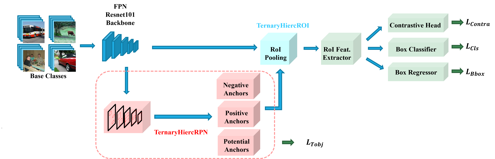

# Identification of Novel Classes for Improving Few-Shot Object Detection

This work is built upon the codebase [FSCE](https://github.com/megvii-research/FSCE) and [FsDet v0.1](https://github.com/ucbdrive/few-shot-object-detection/tags).




## Installation

FsDet is built on [Detectron2](https://github.com/facebookresearch/detectron2). The required dependencies to build `FsDet` is as below. Necessary libraries and functions are available in the folder FsDet. 

**Dependencies**

* Linux with Python >= 3.6
* [PyTorch](https://pytorch.org/get-started/locally/) >= 1.3 
* [torchvision](https://github.com/pytorch/vision/) that matches the PyTorch installation
* Dependencies: ```pip install -r requirements.txt```
* pycocotools: ```pip install cython; pip install 'git+https://github.com/cocodataset/cocoapi.git#subdirectory=PythonAPI'```
* [fvcore](https://github.com/facebookresearch/fvcore/): ```pip install 'git+https://github.com/facebookresearch/fvcore'``` 
* [OpenCV](https://pypi.org/project/opencv-python/), optional, needed by demo and visualization ```pip install opencv-python```
* GCC >= 4.9
* CUDA >= 10.2 (CUDA >= 11 is not recommended)

**Build**

```bash
python setup.py build develop
```

## Data preparation

We adopt the same benchmarks as in FSCE and FsDet, experiments are implemented on two datasets: PASCAL VOC and COCO. 

- [PASCAL VOC](http://host.robots.ox.ac.uk/pascal/VOC/): We use the train/val sets of PASCAL VOC 2007+2012 for training and the test set of PASCAL VOC 2007 for evaluation. We randomly split the 20 object classes into 15 base classes and 5 novel classes, and we consider 3 random splits. The splits can be found in [fsdet/data/datasets/builtin_meta.py](fsdet/data/datasets/builtin_meta.py).
- [COCO](http://cocodataset.org/): We use COCO 2014 without COCO minival for training and the 5,000 images in COCO minival for testing. We use the 20 object classes that are the same with PASCAL VOC as novel classes and use the rest as base classes.

The datasets and data splits are built-in, simply make sure the directory structure agrees with [datasets/README.md](datasets/README.md) to launch the program. 

The default seed that is used to report performace in research papers can be found [here](http://dl.yf.io/fs-det/datasets/).


## Code Structure

The code structure follows Detectron2 v0.1.* and fsdet. 

- **configs**: Configuration  files (`YAML`) for train/test jobs. 
- **datasets**: Dataset files (see [Data Preparation](#data-preparation) for more details)
- **fsdet**
  - **checkpoint**: Checkpoint code.
  - **config**: Configuration code and default configurations.
  - **data**: Dataset code.
  - **engine**: Contains training and evaluation loops and hooks.
  - **evaluation**: Evaluation code for different datasets.
  - **layers**: Implementations of different layers used in models.
  - **modeling**: Code for models, including backbones, proposal networks, and prediction heads.
    - The majority of functionality are implemtended in`modeling/roi_heads/* `, `modeling/contrastive_loss.py`, and  `modeling/utils.py`
    - So one can first make sure  [FsDet v0.1](https://github.com/ucbdrive/few-shot-object-detection/tags) runs smoothly.
  - **solver**: Scheduler and optimizer code.
  - **structures**: Data types, such as bounding boxes and image lists.
  - **utils**: Utility functions.
- **tools**
  - **train_net.py**: Training script.
  - **test_net.py**: Testing script.
  - **ckpt_surgery.py**: Surgery on checkpoints.
  - **run_experiments.py**: Running experiments across many seeds.
  - **aggregate_seeds.py**: Aggregating results from many seeds.


## Train & Inference

### Training

We follow the eaact training procedure of FsDet and we use **random initialization** for novel weights. For a full description of training procedure, see [here](https://github.com/ucbdrive/few-shot-object-detection/blob/master/docs/TRAIN_INST.md).
****
#### 1. Stage 1: Training base detector.

```
sh train.sh

python tools/train_net.py --num-gpus 8 \
        --config-file configs/PASCAL_VOC/base-training/R101_FPN_base_training_split1.yml
```

#### 2. Random initialize  weights for novel classes.

```
sh random_init.sh

python tools/ckpt_surgery.py \
        --src1 checkpoints/voc/faster_rcnn/faster_rcnn_R_101_FPN_base1/model_final.pth \
        --method randinit \
        --save-dir checkpoints/voc/faster_rcnn/faster_rcnn_R_101_FPN_all1
```

This step will create a `model_surgery.pth` from` model_final.pth`. 

Don't forget the `--coco` and `--lvis`options when work on the COCO and LVIS datasets, see `ckpt_surgery.py` for all arguments details.

#### 3. Stage 2: Fine-tune for novel data.

```
sh fintune.sh

python tools/train_net.py --num-gpus 8 \
        --config-file configs/PASCAL_VOC/split1/10shot_CL_IoU.yml
```

#### Evaluation

To evaluate the trained models, run

```angular2html
sh evaluate.sh

python tools/test_net.py --num-gpus 8 \
        --config-file configs/PASCAL_VOC/split1/10shot_CL_IoU.yml \
        --eval-only
```

Or you can specify `TEST.EVAL_PERIOD` in the configuation yml to evaluate during training. Please pay attention to the logs in the terminal to ensure you are evaluation on the correct weight file.

